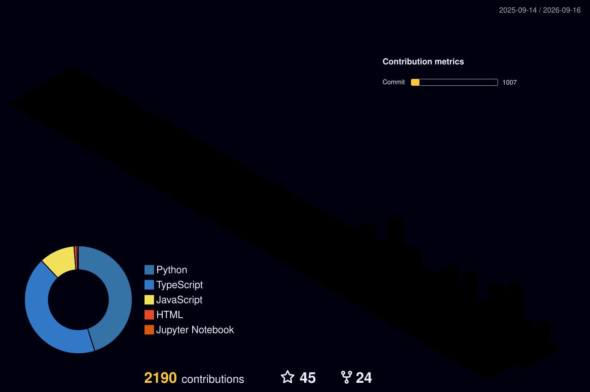

# Zhao Wen

  Python · TypeScript · Multi-Agent · MCP · Atmospheric Data Fusion · Literature

  <em>今人不见古时月，今月曾经照古人。</em> 
  李白《把酒问月》
    
  <em>夫天地者，万物之逆旅也；光阴者，百代之过客也。</em> 
  李白《春夜宴从弟桃花园序》

  
  
  

---

## 👋 About Me

你好，我是 Zhao Wen，主要在 AI 工程与大气环境科研之间工作，也喜欢古诗和文学。

- 🔭 正在构建 **本地优先的 AI 工具、多 Agent 系统与 MCP 服务**
- 🌫️ 长期研究 **空气质量监测-模型数据融合、WRF-CMAQ 与健康效益评估**
- 🧭 关注 **可复用、可验证、可自动化** 的工具与研究流程
- 📍 Guangdong, China

> I build practical systems at the intersection of **AI engineering** and **atmospheric science**.

## 🛠️ Tech Stack

  
  
  
  
  
  
  
  

## ⭐ Featured Projects

### AI / LLM Engineering

| Project | Description |
| --- | --- |
| [weflow-cli](https://github.com/zhuobichen/weflow-cli) | 本地优先的微信数据工具：聊天记录、公众号日报、个人知识库与 MCP。 |
| [dsh-team](https://github.com/zhuobichen/dsh-team) | 多 Agent 团队编排框架：顺序接力与 DAG 图编排。 |
| [pilgrim-intel](https://github.com/zhuobichen/pilgrim-intel) | 统一 AI 情报聚合系统：多信源抓取、摘要与 MCP 查询。 |
| [lingtai-reader](https://github.com/zhuobichen/lingtai-reader) | 纯本地电子书阅读器：书架、阅读、笔记与 AI 助手。 |

### Atmospheric Science

| Project | Description |
| --- | --- |
| [PM25-Fusion-AutoResearch](https://github.com/zhuobichen/PM25-Fusion-AutoResearch) | PM2.5 监测-模型数据融合自动研究框架。 |
| [DataFusion_China_CleanAir](https://github.com/zhuobichen/DataFusion_China_CleanAir) | 中国区域空气质量数据融合与健康效益评估。 |
| [FusionMethods](https://github.com/zhuobichen/FusionMethods) | VNA / eVNA / aVNA / Downscaler 等方法复现与验证。 |
| [guangdong-wrf-cmaq](https://github.com/zhuobichen/guangdong-wrf-cmaq) | 广东省 WRF-CMAQ 空气质量多尺度模拟与评估。 |

## 📊 GitHub Activity

  
  

  

## 🌌 Contribution in 3D

  

  Code, research, and a little moonlight.

